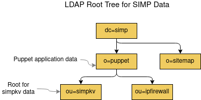

[](http://www.apache.org/licenses/LICENSE-2.0.html)
[](https://bestpractices.coreinfrastructure.org/projects/73)
[](https://forge.puppetlabs.com/simp/simpkv)
[](https://forge.puppetlabs.com/simp/simpkv)
[](https://travis-ci.org/simp/pupmod-simp-simpkv)

#### Table of Contents

<!-- vim-markdown-toc -->

* [Overview](#overview)
* [This is a SIMP module](#this-is-a-simp-module)
* [Module Description](#module-description)
* [Setup](#setup)
  * [What simpkv Affects](#what-simpkv-affects)
  * [Setup Requirements](#setup-requirements)
* [Terminology](#terminology)
* [Usage](#usage)
  * [Single Backend Example](#single-backend-example)
  * [Multiple Backends Example](#multiple-backends-example)
  * [Binary Value Example](#binary-value-example)
  * [Global Key Example](#global-key-example)
  * [Auto-Default Backend](#auto-default-backend)
* [Reference](#reference)
  * [simpkv Function Reference](#simpkv-function-reference)
  * [simpkv Configuration Reference](#simpkv-configuration-reference)
    * [Backend Configuration Entries](#backend-configuration-entries)
    * [Backend Selection](#backend-selection)
  * [Backend Basic](#backend-basics)
    * [Backend Folder Layout](#backend-folder-layout)
    * [Backend Data Format](#backend-data-format)
  * [File Plugin](#file-plugin)
    * [File Plugin Requirements](#file-plugin-requirements)
    * [File Plugin Configuration](#file-plugin-configuration)
  * [LDAP Plugin](#ldap-plugin)
    * [LDAP Plugin Requirements](#ldap-plugin-requirements)
    * [LDAP Plugin Configuration](#ldap-plugin-configuration)
    * [Debugging LDAP Integration Issues](#debugging-ldap-integration-issues)
    * [Other Resources](#other-resources)
* [Limitations](#limitations)
* [Plugin Development](#plugin-development)
* [simpkv Development](#simpkv-development)
  * [Unit tests](#unit-tests)
  * [Acceptance tests](#acceptance-tests)

<!-- vim-markdown-toc GFM -->

## Overview

## This is a SIMP module

This module is a component of the [System Integrity Management Platform](https://simp-project.com),
a compliance-management framework built on Puppet.

If you find any issues, please submit them via [JIRA](https://simp-project.atlassian.net/).

## Module Description

Provides an abstract library that allows Puppet to access one or more key/value
stores.

This module provides

* a standard Puppet language API (functions) for using key/value stores

  * The API is modeled after https://github.com/docker/libkv#interface.
  * See [REFERENCE.md](REFERENCE.md) for more details on the available
    functions.

* a configuration scheme that allows users to specify per-application use
  of different key/value store instances
* adapter software that loads and uses store-specific interface software
  provided by the simpkv module itself and other modules
* interfaces for 2 types of stores

  * **local filesystem store**: Useful for module acceptance tests or small
    sites that are not subject to high-performance and/or high-availability
    requirements.
  * **LDAP store**: Useful for large sites that are subject to high-performance
    and/or high-availability requirements.

* support for creating custom store interfaces

  * a Ruby API for the store interface software that developers can implement
    to provide their own store interface
  * a standard acceptance testing framework developers can use to verify their
    store interfaces work as expected
  * a developers guide.

## Setup

### What simpkv Affects

simpkv manages the contents of one or more key/value stores via Puppet functions
which affect store, retrieve, and modify operations.

### Setup Requirements

simpkv has 3 main setup requirements:

1. simpkv requires hieradata configuration (a `simpkv::options` Hash), when it
   is used to manage the contents of key/value stores.

   * simpkv will operate without any configuration by internally configuring
     itself to use the [auto-default local filesystem store](#auto-default-backend),
     however, this key/value store is really only useful in Puppet module tests.

2. simpkv expects each configured key/value store to be managed elsewhere.

   * You can manage LDAP servers with the `simp/ds389` module.

3. simpkv expects any store-specific interface requirements to be addressed
   elsewhere.

   * Some stores may impose other store-specific requirements in order for their
     simpkv interface software to operate. For example, a store may require
     packages to be installed on a server compiling the Puppet manifests.
   * Any store-specific requirements will be listed in that store's interface
    documentation.

## Terminology

The following terminology will be used throughout the remainder of this document:

* **backend**- A specific key/value store that has unique configuration, (e.g.,
  directory of files on a local filesystem, LDAP server, Consul server, Etcd
  server, Zookeeper server).

* **plugin** - Ruby software that interfaces with a type of backend to affect
  the operations requested in simpkv Puppet functions. For example, the 'ldap'
  plugin manages simpkv data stored in an external LDAP server.

## Usage

Using `simpkv` is simple:

* Use `simpkv` functions to store or retrieve key/value pairs in your Puppet
  code.
* Configure the backend(s) to use in hieradata.
* Reconfigure the backend(s) in hieradata, as your needs change.

  * No changes to your Puppet code will be required.
  * Just transfer your data from the old key/value store to the new one.

The backend configuration of `simpkv` can be as simple as you want (one backend)
or complex (multiple backends of different types servicing different
applications). Examples of both scenarios will be shown in this section.

### Single Backend Example

This example will store and retrieve host information using

* simpkv function signatures that assume the default backend
* hieradata that only configures the default backend.

To store a node's hostname and IP address:

```puppet
simpkv::put("hosts/${facts['clientcert']}", $facts['ipaddress'])
```

To create a hosts file using the list of stored host information:

```puppet
$result = simpkv::list('hosts')
$result['keys'].each |$host, $info | {
  host { $host:
    ip => $info['value'],
  }
}
```

In hieradata, configure the default backend in the ``simpkv::options`` Hash. This
example, will configure simpkv's file backend.

```yaml
simpkv::options:

  # Hash of backend configurations.
  # - We have only the required 'default' entry which will apply to
  #   all simpkv calls.
  backends:
    default:
      # The plugin type and id must be specified.
      type: file
      id: file

      # plugin-specific configuration
      root_path: "/var/simp/simpkv/file"
      lock_timeout_seconds: 30
```

### Multiple Backends Example

This example will store and retrieve host information using

* simpkv function signatures that request a backend based on an application
  identifier
* multi-backend hieradata that supports the request.

The function signatures and hieradata are a little more complicated, but still
relatively straightforward to understand.

To store a node's hostname and IP address using the backend servicing `myapp1`:

```puppet
$simpkv_options = { 'app_id' => 'myapp1' }
$empty_metadata = {}
simpkv::put("hosts/${facts['clientcert']}", $facts['ipaddress'], $empty_metadata, $simpkv_options)
```

To create a hosts file using the list of stored host information using the
backend servicing `myapp1`:

```puppet
$simpkv_options = { 'app_id' => 'myapp1' }
$result = simpkv::list('hosts', $simpkv_options)
$result['keys'].each |$host, $info | {
  host { $host:
    ip => $info['value'],
  }
}
```

In hieradata, configure multiple backends in the ``simpkv::options`` Hash.
This example will configure a single instance of a LDAP backend and two
instances of file backend, assuming we are using simpkv's LDAP and file plugins,
respectively. It is artificially complex, but illustrates the flexibility you
have when configuring backends:

* You can use any mix of backend types.
* You can use multiple instances of a backend type.

  * Each 'type' and 'id' specifies a unique configuration.

* You can map different applications to the same backend.

```yaml
# The backend configurations here will be inserted into simpkv::options
# below via the alias function.

simpkv::backend::ldap_default:
  type: ldap
  id: default
  ldap_uri: ldapi://%2fvar%2frun%2fslapd-simp_data.socket

simpkv::backend::file_myapp:
  type: file
  id: myapp

simpkv::backend::file_yourapp:
  type: file
  id: yourapp


simpkv::options:
  # Hash of backend configurations.
  # * Includes application-specific backends and the required default backend.
  # * simpkv will use the appropriate backend for each simpkv function call.
  backends:
    # Backend for specific myapp_special_snowflake* applications
    "myapp_special_snowflake": "%{alias('simpkv::backend::file_myapp')}"

    # Backend for remaining myapp* applications, including myapp1
    "myapp":                   "%{alias('simpkv::backend::ldap_default')}"

    # Backend for all yourapp* applications
    "yourapp":                 "%{alias('simpkv::backend::file_yourapp')}"

    # Required default backend for everything else, including simpkv
    # function calls with no application identifier
    "default":                 "%{alias('simpkv::backend::ldap_default')}"
```

In this example, we are setting the application identifier to `myapp1` in
our simpkv function calls. simpkv will select `myapp` as the backend to
use for `myapp1`, based on the simple matching algorithm described in
[Backend Selection](#backend-selection).

### Binary Value Example

simpkv is able to store and retrieve binary values, provided the Puppet code
uses the appropriate configuration and functions/types for binary data.

Below is an example of using simpkv for a binary value.

To store the content of a generated keytab file:

```puppet
# Load in the binary content from a file. Returns a Binary Puppet type.
$original_binary_content = binary_file('/path/to/keytabs/app.keytab')

# Set a key/value pair with the binary content
simpkv::put('app/keytab', $original_binary_content)
```

To retrieve the keytab binary content and use it in a `file` resource:

```puppet
# Retrieve a binary value from a key/value store and set a Binary variable
$retrieved_result = simpkv::get('app/keytab')
$retrieved_binary_content = Binary.new($retrieved_result['value'], '%r')

# Persist binary data to another file
file { '/different/path/to/keytabs/app.keytab':
  content => $retrieved_binary_content
}

```

### Global Key Example

By default, the key/folder path referenced in a simpkv function is tied to
the Puppet environment of the node whose manifest is being compiled. This
ensures the data stored for one Puppet environment (e.g., 'dev') does not
corrupt the data for another Puppet environment (e.g., 'production').
Nevertheless, there are times in which you may want to store data that
is applicable to all Puppet environments, instead. simpkv supports global
data through an option in each simpkv function call.

Below is an example of using simpkv to store a node's hostname and IP address
as global data:

```puppet
$simpkv_options = { 'global' => true }
$empty_metadata = {}
simpkv::put("hosts/${facts['clientcert']}", $facts['ipaddress'], $empty_metadata, $simpkv_options)
```

To create a hosts file using the list of stored, global host information:

```puppet
$simpkv_options = { 'global' => true }
$result = simpkv::list('hosts', $simpkv_options)
$result['keys'].each |$host, $info | {
  host { $host:
    ip => $info['value'],
  }
}
```

### Auto-Default Backend

simpkv is intended to be configured via `simpkv::options` and any
application-specific configuration passed to the simpkv Puppet functions.
However, to facilitate Puppet manifest testing and the rollout of simpkv
capabilities (specifically, the use of simpkv internally in `simplib::passgen`),
when `simpkv::options` is not set in hieradata, simpkv will automatically use
the 'file' plugin to store key/value data on the local filesystem. This is
equivalent to the following `simpkv::options` hieradata:

```yaml
simpkv::options:
  environment: "%{server_facts.environment}"
  softfail: false
  backend: default
  backends:
    default:
      type: file
      id: auto_default
```

The 'file' plugin id described [here](#file-plugin).

## Reference

### simpkv Function Reference

See [REFERENCE.md](./REFERENCE.md) for the module's function reference.

### simpkv Configuration Reference

The simpkv configuration used for each simpkv function call is comprised of
a merge of

* function-provided options Hash
* hieradata configuration specified by the `simpkv::options` Hash
* global configuration defaults.

The merge is executed in a fashion to ensure the function-provided options take
precedence over the `simpkv::options` hieradata values and global defaults.

The merged simpkv configuration contains global and backend-specific
configurations, along with an optional, function-provided application
identifier. The primary keys in this Hash are as follows:

* `app_id`: Optional String from simpkv function calls, only. Specifies an
  application name that can be used to identify which backend configuration
  to use via fuzzy name matching, in the absence of the `backend` option.

  * More flexible option than `backend`.
  * Useful for grouping together simpkv function calls found in different
    catalog resources.
  * See [Backend Selection](#backend-selection).

* `backend`: Optional String. Specifies a definitive backend configuration
  to use.

  * Takes precedence over `app_id`.
  * When present, must match a key in `backends` and will be used unequivocally.

    * If that backend does not exist in `backends`, the simpkv function will fail.

  * When absent, the backend configuration will be selected from the set of
    entries in `backends`, using the `app_id` option if specified.
  * See [Backend Selection](#backend-selection).

* `backends`: Required Hash. Specifies backend configurations. Each key
  is the name of a backend configuration and its value contains the
  corresponding configuration Hash.

  * Each key is a String.
  * Must include a 'default' key.
  * More than one key can use the same backend configuration.
  * See [Backend Configuration Entries](#backend-configuration-entries)
    for more details about a backend configuration Hash.

* `global`: Optional Boolean. Set to `true` when the key being accessed
  is global. Otherwise, the key will be tied to the Puppet environment
  of the node whose manifest is being compiled.

  * Defaults to `false`.

* `softfail`: Optional Boolean. Whether to ignore simpkv operation failures.

  * When `true`, each simpkv function will return a result object even when the
    operation failed at the backend.
  * When `false`, each simpkv function will fail when the backend operation
    failed.
  * Defaults to `false` when absent.

#### Backend Configuration Entries

Each backend configuration entry in `backends` is a Hash. The Hash must
contain `type` and `id` keys, where the (`type`,`id`) pair defines a unique
configuration (i.e., unique plugin instance).

* `type` is the type of plugin, e.g., 'ldap'.

  * 'file' and 'ldap' are provided by the simpkv module.
  * Other modules may provide their own plugins.

* `id` is the instance identifier for a `type`.
* Other keys for configuration specific to the backend may also be present.

#### Backend Selection

The backend to use for a simpkv Puppet function call will be determined from
the merged simpkv options Hash as follows:

* If a specific backend is requested via the `backend` key in the merged simpkv
  options Hash, that backend will be selected.

  * If that backend does not exist in `backends`, the simpkv function will fail.

* Otherwise, if an `app_id` option is specified in the merged simpkv options
  Hash and it matches a key in the `backends` Hash, exactly, that backend will
  be selected.
* Otherwise, if an `app_id` option is specified in the merged simpkv options
  Hash and it starts with the key in the `backends` Hash, that backend will be
  selected.

  * When multiple backends satisfy the 'start with' match, the backend with the
    most matching characters is selected.

* Otherwise, if the `app_id` option does not match any key in in the `backends`
  Hash or is not present, the `default` backend will be selected.

To clarify this backend selection algorithm, consider a site in which simpkv is
configured for multiple backends in the following ``simpkv::options`` Hash.

```yaml
simpkv::options:
  # Hash of backend configurations.
  # * Includes application-specific backends and the required default backend.
  # * simpkv will use the appropriate backend for each simpkv function call.
  backends:
    # Backend for specific myapp_special_snowflake* applications
    "myapp_special_snowflake":
      type: file
      id: myapp_special_snowflake

    # Backend for remaining myapp* applications
    "myapp":
      type: file
      id: myapp

    # Backend for all yourapp* applications
    "yourapp":
      type: file
      id: yourapp

    # required default backend for everything else, including simpkv
    # function calls with no application identifier
    "default":
      type: file
      id: default
```

The following table shows the backend that simpkv will select make given the
options specified by the simpkv function call.

| simpkv Function Call                           | Backend Selected    | Comments                        |
|----------------------------------------------- | ------------------- | --------------------------------|
| `simpkv::get('key')`                           | `default`           | No special handling requested   |
| `simpkv::get('key', {'backend' => 'yourapp'})` | `yourapp`           | Specific backend requested      |
| `simpkv::get('key', {'backend' => 'oops'})`    | N/A                 | Function will fail since 'oops' backend does not exist |
| `simpkv::get('key', {'app_id' => 'myapp'})`    | `myapp`             | Exact match                     |
| `simpkv::get('key', {'app_id' => 'myapp1'})`   | `myapp`             | Starts with match               |
| `simpkv::get('key', {'app_id' => 'myapp_special'})` | `myapp`        | Starts with match               |
| `simpkv::get('key', {'app_id' => 'myapp_special_snowflake_for_bob'})` | `myapp_special_snowflake` | Starts with match |
| `simpkv::get('key', {'app_id' => 'otherapp'})` | `default`           | No match so fallback to default |

### Backend Basics

This section describes details about the folder layout and format of data
stored by simpkv that you may find useful when you are inspecting data in
a backend.

#### Backend Folder Layout

The storage in a simpkv backend can be notionally represented as a folder
tree with key files at terminal nodes. simpkv automatically sets up the
folder layout at the top level and the user specifies key files below that.
Specifically,

* simpkv stores global keys in a `globals` sub-folder of the root folder.

  * Global keys are not tied to any specific Puppet environment.
  * You must specify `'global' => true` in the options passed to
    simpkv functions in order to access global keys.

* simpkv stores all other keys in sub-folders named for the Puppet
  environment in which each key was created.

  * The parent directory for all environment folders is
    `<root folder>/environments`.

* Further sub-folder trees are allowed for global or environment-specific keys.

  * A relative paths in a key name indicates a sub-folder tree (e.g.
   `'app1/keya'`).

For example,


The *actual* representation of the root folder and 'key file' is backend specific.

### Backend Data Format

Internally, simpkv automatically serializes each key's value and optional
metadata into a string for backend storage, and then deserializes it upon
retrieval. The string is a JSON representation of a Hash with at least 2
attributes:

* `value`: Always present. Key's value
* `metadata`: Always present. Key's metadata
* `encoding` and `original_encoding`: Only present when the key's value is a
  Puppet Binary type. Indicates simpkv's internal encoding of the binary data
  into a representation suitable for JSON.

  * simpkv uses strict Base64 encoding.

This serialization simplifies plugin development, but does limit the types of
data that can be stored in the value and metadata. simpkv works with the
following types:

* *Simple type*: String, boolean, or numeric values
* *Standard complex type*: Hash, Array, or nested Hash/Array structure whose
  terminal nodes are simple types
* *Binary type*: Puppet Binary type when it is the key's value, only; not in
  any complex values or metadata

The table below shows a few examples of the serialization for clarification.


| Value Type | Serialized String     |
| ---------- | --------------------- |
| Simple without metadata | `{"value":10,"metadata":{}}` |
| Simple with metadata | `{"value":true,"metadata":{"verified":true,"user":"vsmith"}}` |
| Array with metadata | `{"value":[1,2,3],"metadata":{"originator":"njones","location":{"room":"29B","rack":10}}}` |
| Hash without metadata | `{"value":{"attr1":"hello","attr2":{"part1":9.898,"part2":[1,2,3]}},"metadata":{}` |
| Binary transformed by simpkv without metadata | `{"value":"<Base64 (strict) encoded string>","encoding":"base64","original_encoding":"ASCII-8BIT","metadata":{}"}` |


## File Plugin

simpkv provides a plugin that maintains a file-based key/value store on the
local filesystem on the server on which the Puppet manifests are being compiled.
It effectively uses system commands to affect local filesystems changes.

* This plugin is appropriate for Puppet module tests.
* This plugin can be used for small-sites in which there is only a single server
  compiling Puppet manifests.

### File Plugin Requirements

* The file plugin must be configured for a local filesystem on the server
  compiling the Puppet manifests.

  * The file locking mechanism the plugin uses to ensure the integrity of the
    key files is only guaranteed to work on a **local** filesystem, and is
    **not** suitable for shared filesystems such as NFS.

* The file plugin must have write privileges for the configured `root_path` for
  the user compiling the manifests.
* The file plugin must **not** be used for sites using distributed Puppet servers.

  * The file plugin has no mechanisms to distribute the key/store to other
    compile servers.

### File Plugin Configuration

The plugin has a backend type `file`, and supports the following plugin-specific
configuration parameters.

* `root_path`: Optional. Root directory path for the key files

  * Defaults to `/var/simp/simpkv/file/<id>` when that directory can be created
    or `<Puppet[:vardir]>/simp/simpkv/<name>` otherwise.

* `lock_timeout_seconds`: Optional. Maximum number of seconds to wait for an
  exclusive file lock on a file modifying operation before failing the
  operation.

  * Defaults to 5 seconds.

Here is an example configuration for the file plugin:

```yaml
simpkv::options:
  backends:
    default:
      type: file
      id:   default
```

## LDAP Plugin

simpkv provides a plugin to interface with a LDAP key/value store configured
with a simpkv LDAP schema. If your site is large and requires a
high-availability, distributed key/value store, LDAP is the appropriate
backend to use! The benefits of using LDAP are as follows:

* LDAP supports the storage of any data, not just accounts data.
* LDAP is well defined protocol implemented by a wide variety of client and
  server implementations.
* LDAP is secure.
* LDAP server implementations are highly performant.
* LDAP server implementations support replication.

### LDAP Plugin Requirements

The LDAP plugin has 4 main requirements:

1. The package providing `ldapadd`, `ldapdelete`, `ldapmodify` and `ldapsearch`
   (i.e. `openldap-clients`) must be installed on the system on which the Puppet
   manifests will be compiled.

2. The LDAP server must be loaded with the
   [simpkv LDAP schema](docs/simpkv_LDAP_DIT_and_schema.md).

3. The root Directory Name (DN) for the simpkv tree in LDAP must already
   exist.

     * This corresponds to the LDAP plugin's `base_dn` configuration parameter.

4. The supplied LDAP configuration must permit the user compiling the Puppet
   manifests to modify the LDAP tree below that 'simpkv' root DN.

**In addition**, if LDAPI is not the protocol being being used to communicate
with the LDAP server, the configured password file used for simple
authentication with the LDAP server **MUST** already exist before the catalog
is compiled.

* Catalog compilation will fail if you attempt to create the file using a `file`
  Puppet resource in the same catalog as simpkv function calls. This is because
  the simpkv functions will be evaluated before the `file` resource in the
  compilation.

### LDAP Plugin Configuration

The simpkv LDAP plugin is of type `ldap` and supports the following
plugin-specific configuration parameters.

* `ldap_uri`: Required. The LDAP server URI.

  * This can be a LDAPI socket path or an ldap/ldaps URI specifying host and,
    optionally, port.
  * When using an 'ldap://' URI with StartTLS, `enable_tls` must be true and
    `tls_cert`, `tls_key`, and `tls_cacert` must be configured.
  * When using an 'ldaps://' URI, `tls_cert`, `tls_key`, and `tls_cacert` must
    be configured.

* `base_dn`: Optional. The root DN for the 'simpkv' tree in LDAP.

  * Defaults to 'ou=simpkv,o=puppet,dc=simp'
  * Must already exist

* `admin_dn`: Optional. The bind DN for simpkv administration.

  * Defaults to 'cn=Directory_Manager'
  * This identity must have permission to modify the LDAP tree below `base_dn`.

* `admin_pw_file`: Required for all but LDAPI. A file containing the simpkv
  adminstration password.

  * Will be used for authentication when set, even with LDAPI.
  * When unset for LDAPI, the `admin_dn` is assumed to be properly configured
    for external EXTERNAL SASL authentication for the user compiling the manifest
    (e.g., 'puppet' for 'puppet agent', 'root' for 'puppet apply' and the Bolt
    user for Bolt plans).

* `enable_tls`: Optional. Whether to enable TLS.

  * Defaults to true when `ldap_uri` is an 'ldaps://' URI, otherwise defaults
    to false.
  * Must be set to true to enable StartTLS when using an 'ldap://' URI.
  * When true `tls_cert`, `tls_key` and `tls_cacert` must be set.

* `tls_cert`: Required for StartTLS or TLS. The certificate file.
* `tls_key`: Required for StartTLS or TLS. The key file.
* `tls_cacert`: Required for StartTLS or TLS. The cacert file.
* `retries`: Optional. Number of times to retry an LDAP operation if the
  server reports it is busy.

  * Defaults to 1.

Here are some example configurations:

* To use LDAPI (best option if the Puppet manifest compilation is being done on
  the LDAP server), configure the LDAP plugin as follows:

```yaml
  simpkv::options:
    backends:
      default:
        type: ldap
        id:   default

        # Set this to your LDAP server's LDAPI URI
        ldap_uri: ldapi://%2fvar%2frun%2fslapd-simp_data.socket
```

* To use LDAPS, configure the LDAP plugin as follows:

```yaml
  simpkv::options:
    backends:
      default:
        type: ldap
        id:   default

        # Set this to your LDAP server's LDAPS URI
        ldap_uri: ldaps://ldap.example.com

        # Set this to the location of your administration DN password file
        admin_pw_file: /etc/simp/simpkv_pw.txt

        # Set these to the appropriate certs for your server
        tls_cert:     /etc/pki/simp_apps/openldap/public/puppetserver.example.com.pub
        tls_key:      /etc/pki/simp_apps/openldap/private/puppetserver.example.com.pem
        tls_cacert:   /etc/pki/simp_apps/openldap/cacerts/cacerts.pem
```

* To use LDAP with StartTLS, configure the LDAP plugin as follows:

```yaml
  simpkv::options:
    backends:
      default:
        type: ldap
        id:   default

        # Set this to your LDAP server's LDAP URI
        ldap_uri: ldap://ldap.example.com

        # Set this to the location of your administration DN password file
        admin_pw_file: /etc/simp/simpkv_pw.txt

        # Use StartTLS with the LDAP URI
        enable_tls: true

        # Set these to the appropriate certs for your server
        tls_cert:     /etc/pki/simp_apps/openldap/public/puppetserver.example.com.pub
        tls_key:      /etc/pki/simp_apps/openldap/private/puppetserver.example.com.pem
        tls_cacert:   /etc/pki/simp_apps/openldap/cacerts/cacerts.pem
```


The LDAP plugin creates the key/value store for each instance under its own
tree on the LDAP server. The tree's DN is *ou=<instance id>,ou=instances,<base_dn>*,
where the instance id is the 'ldap' plugin's `id` configuration parameter. So,
you can actually use the same LDAP server for different plugin instances.

Here is an example configuration of multiple instances with the same LDAPI
configuration:

```yaml
  simpkv::options:
    backends:
      # stored under the 'myapp' instance tree of the simp_data LDAP server
      myapp:
        type: ldap
        id:   myapp
        ldap_uri: ldapi://%2fvar%2frun%2fslapd-simp_data.socket

      # stored under the 'default' instance tree of the simp_data LDAP server
      default:
        type: ldap
        id:   default
        ldap_uri: ldapi://%2fvar%2frun%2fslapd-simp_data.socket
```

### Debugging LDAP Integration Issues

When you are trying to debug LDAP integration issues, use the `--debug`
option during manifest compilation to see more details about what the
LDAP plugin is doing. For example,

```shell
puppet apply -t --debug my_manifests.pp
```

Using this option will log the exact LDAP commands used during simpkv
function calls.

### Other Resources

The `ldap_plugin` acceptance test suite is complete example on how to use the
LDAP plugin. It demonstrates the following:

* How to configure simpkv to use the LDAP plugin for LDAPI unencrypted LDAP,
  LDAP + StartTLS, and LDAPS protocols.
* How to stand up simple 389-DS LDAP instances for those protocol options.

  Each 389-DS instance is

  * Created by the `simp/ds389` module.
  * Bootstrapped with a LDIF that corresponds to the simpkv leg of the SIMP Data
    Root Directory Information Tree (DIT) shown below.
    

  * Explicitly configured with non-standard ports, so as to not be confused
    with LDAP servers used for accounts management.
  * Loaded with the [simpkv LDAP schema](docs/simpkv_LDAP_DIT_and_schema.md).

## Limitations

* SIMP Puppet modules are generally intended to be used on a Red Hat Enterprise
  Linux-compatible distribution such as EL7 and EL8.

* `simpkv` only supports the use of binary data for the value when that data is
   a Puppet `Binary`. It does not support binary data which is a sub-element of
   a more complex value type (e.g. `Array[Binary]` or `Hash` that has a key or
   value that is a `Binary`).

* `simpkv` does not support custom data types that cannot be serialized to JSON
  by the Ruby libraries provided by Puppet.

* simpkv's file plugin is only guaranteed to work on local filesystems. It may not
  work on shared filesystems, such as NFS.

* SIMP does not yet manage the LDAP server configured for simpkv data.

  * See the `ldap_plugin` acceptance test suite for an example of how to set up
    a simple 389-DS LDAP instance for simpkv data.

## Plugin Development

Please see [simpkv Plugin Development Guide](docs/simpkv_plugin_development_guide.md)
for details on how to write your own custom plugin.

## simpkv Development

Please read our [Contribution Guide] (https://simp.readthedocs.io/en/stable/contributors_guide/index.html).

### Unit tests

Unit tests, written in ``rspec-puppet`` can be run by calling:

```shell
bundle install
bundle exec rake spec
```

### Acceptance tests

This module includes [Beaker](https://github.com/voxpupuli/beaker) acceptance
tests using the SIMP [Beaker Helpers](https://github.com/simp/rubygem-simp-beaker-helpers).
By default the tests use [Vagrant](https://www.vagrantup.com/) with
[VirtualBox](https://www.virtualbox.org) as a back-end; Vagrant and VirtualBox
must both be installed to run these tests without modification.

To execute all of the tests run the following:

```shell
bundle install
bundle exec rake beaker:suites
```

To execute an individual suite for a specific nodeset, add the suite and the
nodeset to the `beaker:suites` task. For example,

```shell
bundle exec rake beaker:suites[ldap_plugin,default]
```

Some environment variables that may be useful:

```shell
BEAKER_debug=true
BEAKER_destroy=no
BEAKER_fips=yes
BEAKER_provision=no
```

* `BEAKER_debug`: Show the commands being run on the virtual machines and their
  output.
* `BEAKER_destroy=no`: Prevent the virtual machine destruction after the tests
  finish so you can inspect the state.
* `BEAKER_fips=yes`: Enable FIPS-mode on the virtual machines.

  * This can take a long time, because it must enable FIPS in the kernel
    command-line, rebuild the initramfs, then reboot.

* `BEAKER_provision=no`: Prevent the virtual machine from being recreated.

  * This can save a lot of time while you're writing the tests.

Please refer to the [SIMP Beaker Helpers documentation](https://github.com/simp/rubygem-simp-beaker-helpers/blob/master/README.md)
for more information.
