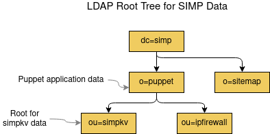
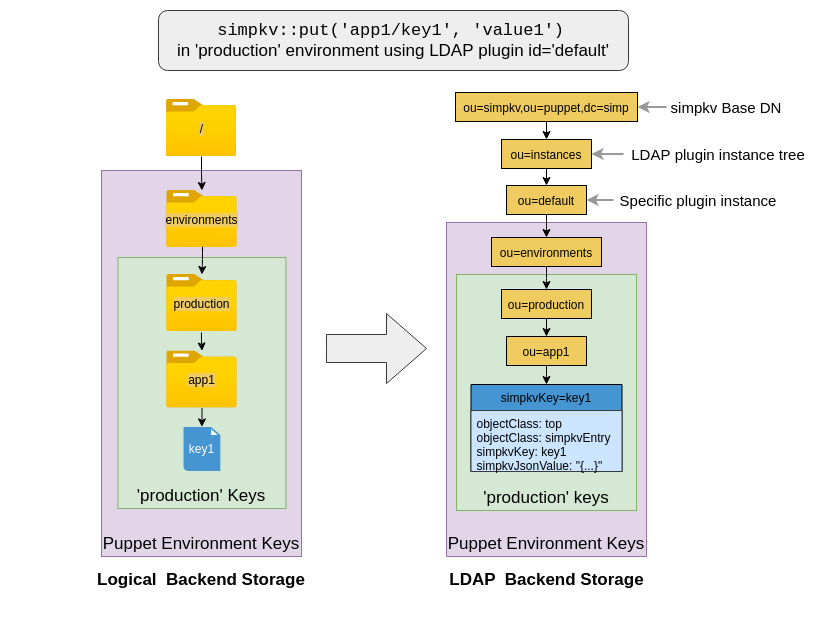
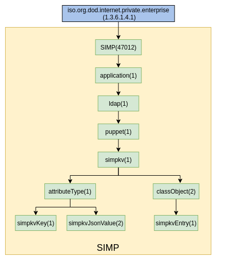

#### Table of Contents

<!-- vim-markdown-toc -->
* [Introduction](#introduction)
* [simpkv DIT](#simpkv-dit)
* [simpkv OID Subtree and Custom LDAP Schema](#simpkv-oid-subtree-and-custom-ldap-schema)
  * [simpkv OIDs](#simpkv-oids)
  * [simpkv Custom LDAP Schema](#simpkv-custom-ldap-schema)

## Introduction

This document describes the simpkv subtree of SIMP Data LDAP Directory Information
Tree (DIT) and its custom LDAP schema.

Readers are assumed to already have a basic understanding of simpkv and LDAP.

## simpkv DIT

SIMP has designed a LDAP DIT to store non-accounts, site data such as simpkv
data. The root of this DIT is depicted below and uses standard LDAP object
classes and attributes:



The subtree beneath the *simpkv* root Directory Name (DN),
*ou=simpkv,o=puppet,dc=simp*, has been designed explicitly to support simpkv
data. It is a simple mapping of the notional, file directory tree representation
of backend storage to a LDAP DIT, but it adds a tree for LDAP backend instances.

A pictoral representation of this mapping is as follows:



The simpkv subtree of the SIMP Data DIT uses both standard and custom LDAP
object classes and attributes. Specifically,

* Folders in a key path, LDAP plugin instance identifiers and other grouping
  added by either the simpkv adapter or the LDAP plugin (i.e., grouping for
  types of keys) are represented by standard organizational units (`ou`).

* Key/value entries are represented by a custom object class, `simpkvEntry`
  with custom key name and value attributes, `simpkvKey` and `simpkvJson Value`.

* The DN for a key/value node is constructed using each part of the key path
  as a Relative DN (RDN).


## simpkv OID Subtree and Custom LDAP Schema

The simpkv DIT data requires at a custom LDAP object class to hold the key
and JSON serialized value attributes. This custom LDAP object class and its
attributes must be specified by unique OIDs. This section describes the SIMP
OID subtree that was designed to support these custom LDAP OIDs and then
uses the OIDs in schemas for the simpkv DIT discussed above.

### simpkv OIDs

SIMP has an officially registered OID,
[1.3.6.1.4.1.47012](http://www.oid-info.com/get/1.3.6.1.4.1.47012), under which
all OIDs for Puppet, SNMP, etc. reside. Best practices for OID assignment
dictate that once an OID is in use, its definition is not supposed to change.
In other words, an OID can be deprecated, but not removed or reassigned a
different name. So, SIMP's OID tree has been designed to allow future expansion.

Below is the (to be published) SIMP OID subtree showing the OIDs required for
simpkv's LDAP custom schema. It organizes the OIDs for attributes and class
objects under corresponding parent OIDs.



### simpkv Custom LDAP Schema

The custom schema for the simpkv DIT uses the simpkv OIDs and is shown below.
It has a custom object class, `simpkvEntry`, that is comprised of two custom
attributes, `simpkvKey` and `simpkvJsonValue`.

* `simpkvKey` is a case-invariant string for the key (excluding path)

  * This is used as the final RDN for a key/value node.

* `simpkvJsonValue` is a case-sensitive string for the JSON-formatted value.

```
################################################################################
#
dn: cn=schema
#
################################################################################
#
attributeTypes: (
  1.3.6.1.4.1.47012.1.1.1.1.1.1
  NAME 'simpkvKey'
  DESC 'key'
  SUP name
  SINGLE-VALUE
  X-ORIGIN 'SIMP simpkv'
  )
#
################################################################################
#
attributeTypes: (
  1.3.6.1.4.1.47012.1.1.1.1.1.2
  NAME 'simpkvJsonValue'
  DESC 'JSON-formatted value'
  EQUALITY caseExactMatch
  SUBSTR caseExactSubstringsMatch
  SYNTAX 1.3.6.1.4.1.1466.115.121.1.15
  SINGLE-VALUE
  X-ORIGIN 'SIMP simpkv'
  )
#
################################################################################
#
objectClasses: (
  1.3.6.1.4.1.47012.1.1.1.1.2.1
  NAME 'simpkvEntry'
  DESC 'simpkv entry'
  SUP top
  STRUCTURAL
  MUST ( simpkvKey $ simpkvJsonValue )
  X-ORIGIN 'SIMP simpkv'
  )
```
