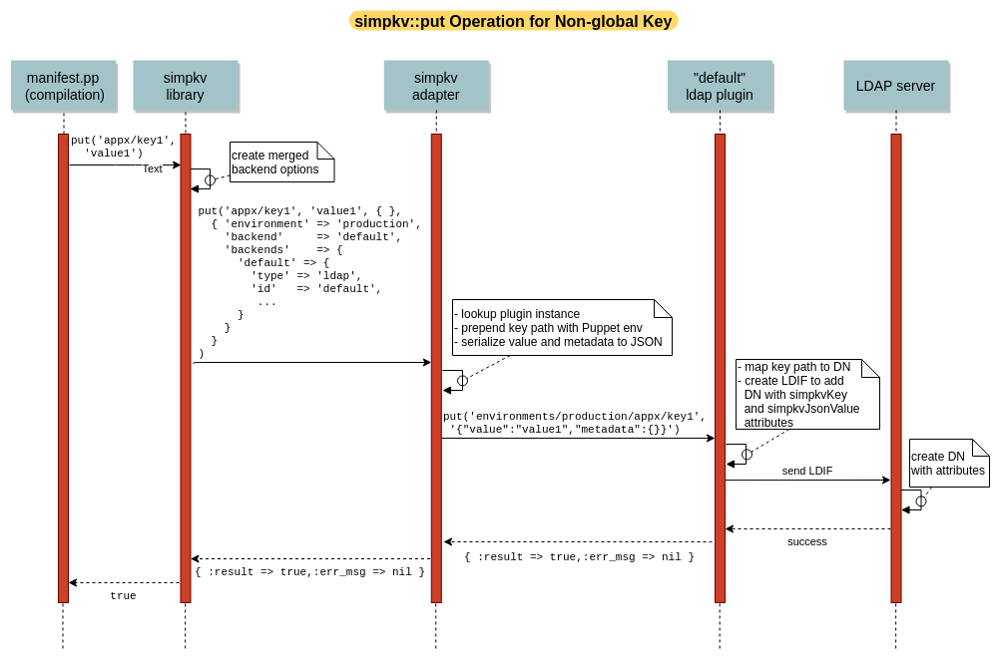

#### Table of Contents

<!-- vim-markdown-toc -->

* [Introduction](#introduction)
* [Terminology](#terminology)
* [Plugin Overview](#plugin-overview)
  * [Plugin Instance Lifecycle](#plugin-instance-lifecycle)
  * [Plugin Loading ](#plugin-loading)
    * [Why worry about cross contamination](#why-worry-about-cross-contamination)
* [Implementing the Plugin API](#implementing-the-plugin-api)

<!-- vim-markdown-toc GFM -->

## Introduction

This is a developers guide for writing custom simpkv plugins. simpkv plugins
are the software interfaces used by simpkv functions to affect the requested
store, retrieve, and modify operations on the key/value stores.

This guide assumes the plugin writer has the following prequisite knowledge:

* A basic understanding of what [simpkv provides and how it used and configured](../README.md).
* Ruby
* rspec for unit testing (aka 'spec' testing).

In addition, a basic understanding of how to acceptance test Puppet modules
using [Beaker](https://github.com/voxpupuli/beaker) is helpful.

## Terminology

The following terminology will be used throughout this document:

* **backend**- A specific key/value store that has unique configuration, (e.g.,
  directory of files on a local filesystem, LDAP server, Consul server, Etcd
  server, Zookeeper server).

* **plugin** - Ruby anonymous class to interface with a type of backend to
  affect the operations requested in simpkv Puppet functions.

  * The class implements the simpkv plugin API for a specific backend type.
  * The class will be instantiated and configured for each backend configuration
    of that type.

* **plugin instance** - Instance of the plugin class that is configured for
  specific backend configuration

  * Uniquely identified by configured plugin (`'type'`, `'id'`) pair.

* **plugin adapter** - Internal simpkv Ruby software that loads plugin software,
  instantiates plugin objects, and then executes a plugin API call on the appropriate
  plugin object to affect a simpkv function call. It also normalizes key paths
  and data to be stored (the key's value and metadata), so that plugins simply
  manage storage of strings at specified paths.

## Plugin Overview

Before implementing a plugin, it is useful to have a basic understanding of the
simpkv internal framework for loading plugin software, instantiating plugin
objects, and then using those objects to affect store/retrieve/modify
operations.

Conceptionally, you can divide the simpkv internals into 3 pieces:

* *simpkv library*: A set of simpkv Puppet library functions that provide the
  abstract key/value store API to Puppet manifests and does the following with
  each simpkv API function call

  * Creates merged simpkv options for the plugin adapter and plugins using
    configuration provided by simpkv function signature, `simpkv::options`
    hieradata, internal defaults, and the Puppet environment for which the
    compilation is being done.

    * Ensures the 'backend' attribute is set to identify the backend to use.
    * Adds the 'environment' attribute with the name of the Puppet environment.

  * Ensures the simpkv plugin adapter is loaded and available for the duration
    of the catalog run.
  * Delegates the function to the corresponding plugin adapter function and
    waits for the result.
  * Returns the plugin adapter's function result to the requesting Puppet
    manifest or fails, per `simpkv::options::softfail` configuration.

* *simpkv adapter*: A Ruby plugin adapter that loads all available plugin Ruby
  files when it is first loaded and then does the following for each function
  that corresponds to a simpkv Puppet function call:

  * Ensures the appropriate plugin instance required for the simpkv function
    call is constructed, configured, and then cached for the duration of the
    catalog run.

  * Adds the appropriate prefix to the key path

    * `environments/<Puppet environment>/` for Puppet environment keys.
    * `globals/` for global keys.

  * Serializes the a key's value and metadata to a single string on `simpkv::put`
    operation.

    * The stored format is a JSON string described in the [simpkv README](../README.md)

  * Delegates the function to the corresponding plugin adapter function and
    waits for the result.
  * Deserializes key value and metadata strings on `simpkv::get` or `simpkv::list`
    operations back to value and metadata objects.
  * Removes key path prefixes on a `simpkv::list` operation.
  * Returns the result.

* *instance plugin*: An instance of the Ruby plugin code for a plugin type that
  affects the store operation, after being configured.

The relationship among the simpkv internal pieces and the key/value store during
manifest compilation will be clarified by the following notional sequence
diagram for an example `simpkv::put` operation. These diagrams assumes we are
using the LDAP plugin and that the simpkv adapter has been loaded and has
already constructed and configured the 'default' LDAP plugin instance.

### Plugin Instance Lifecycle

<!-- TODO this could benefit from a diagram -->
All plugin files are loaded the first time any simpkv API function is evaluated
in a catalog compile (similar to using `require` for the each plugin file).
However, each plugin instance is only constructed and configured the first time
it is required for a simpkv function. Each plugin instance is then persisted
until the catalog compile finishes, so it can be used for any subsequent simpkv
function calls that require that backend configuration.

The plugin instance caching during a catalog compile allows each plugin type
to use the most efficient mechanism available for affecting one or more
transactions with the backend. Just be aware there is not 'destructor' in Ruby.
The plugin objects will go out of scope when the catalog compile finishes, but
the object removal is subject to garbage collection.

### Plugin Loading

Each plugin is written in pure Ruby and, to prevent [cross-Puppet-environment
contamination](#why-worry-about-cross-contamination), is implemented as an
anonymous class that is automatically loaded by the simpkv adapter with each
Puppet compile. Specifically, the simpkv adapter will load any module file
whose

* path is `<any module name>/lib/puppet_x/simpkv`
* filename ends with `_plugin.rb`
* content contains valid Ruby and is an anonymous class with the Class
  definition line that is **exactly** as shown in
  [simpkv's plugin_template.rb](../lib/puppet_x/simpkv/plugin_template.rb).

The simpkv adapter parses each plugin's filename to determine its type,
internally stores the anonymous class for that plugin in a Hash, and then
creates an instance from the stored anonymous class when needed.

  * It assumes the filename format is `<plugin name>_plugin.rb`.
  * It only loads the first plugin for any type.
  * It emits warnings for duplicate plugin names and malformed plugins.

If this convoluted but necessary loading mechanism seems a bit complex, it is,
but don't worry!  If you create an appropriately named plugin file in your
module, ensure your plugin filename is unique across all Puppet modules, and
follow the instructions provided for implementing and testing your plugin,
you will not have problems with plugin loading or
cross-Puppet-environment-contamination.

#### Why worry about cross contamination

[Puppet-environment cross contamination](https://tickets.puppetlabs.com/browse/SERVER-94)
occurs when Ruby code from Puppet modules in one Puppet environment is
erroneously used in a Puppet manifest compile for a different Puppet
environment. Puppet has done an excellent job of solving this contamination
problem for standard Ruby Puppet code (Puppet Ruby API functions, facts, custom
types and providers). Unfortunately, the infrastructure required for simpkv
falls outside the bounds of standard Puppet code. So, we have to take steps to
ensure cross-contamination does not occur in any of the simpkv internals,
including simpkv plugins. Specifically, we need to make sure that any Ruby code
simpkv internally loads in any given Puppet compiler instance is only from the
Puppet code for that Puppet environment.

This code loading requirement means that simpkv cannot use load its adapter or
the software for a particular plugin using a normal Ruby `require`, such as
`require 'ldap_plugin'`. Other more oblique methods are required.

When simpkv was developed, two primary solutions for ensuring that
cross-contamination does not occur were considered:

* Generate plugin class names dynamically and ensure the Puppet environment is
  part of the each class name.
* Use anonymous classes.

Both are painful. Using the anonymous class method seemed the least painful of
the two.

## Implementing Plugin API

To create your own plugin

1. Create a `lib/puppet_x/simpkv` directory within your plugin module.
2. Copy [simpkv's lib/puppet_x/simpkv/plugin_template.rb](../lib/puppet_x/simpkv/plugin_template.rb)
   into that directory with a name `<your plugin name>_plugin.rb`.  For example,
   `my_module_consul_plugin.rb`.
3. **READ all the documentation in your plugin skeleton**, paying close attention
   the *SIMPKV PLUGIN REQUIREMENTS* discussion.

   * You may find it helpful to peruse simpkv's LDAP and file plugin
     implementations if you have any questions about the API.

4. Implement the body of each method as identified by a `FIXME`.

   * Make sure your implementation handles any exceptions, locally, and returns
     exactly what the API dictates.

<!-- TODO Should provide a template spec test file -->
5. Write unit tests for your plugin, using the unit tests for simpkv's LDAP
   and file plugins as examples.

   * Your plugin's tests can be written using the same unit test infrastructure
     you use for Puppet module spec testing.
   * The unit tests for simpkv's plugins can be found at
     [spec/unit/puppet_x/simpkv/](../spec/unit/puppet_x/simpkv).
   * Both plugin tests shows you how to instantiate an object of your plugin
     for unit testing purposes.

     * This is simple, but something you normally don't have to worry about for
       Puppet module testing.

   * The LDAP plugin test demonstrates how to using rspec mocking for simulating
     external interactions.

<!-- TODO Should provide an acceptance test template file separate simpkv_test
     into its own module so it can be used more easily by other modules -->
6. Write acceptance tests for your plugin, using the acceptance tests for
   simpkv's LDAP and file plugins in
   [spec/acceptance/suites/ldap_plugin/](../spec/acceptances/suites/ldap_plugin),
   and [spec/acceptance/suites/default/](../spec/acceptances/suites/default),
   as examples. These tests use the
   ['simpkv plugin test' shared_examples](../spec/acceptance/shared_examples/simpkv_plugin.rb)
   to exercise and validatate plugin operation via a standard set of simpkv
   function calls operations.

   * Use the *'simpkv plugin' shared_examples* if you want to ensure your
     plugin works in the same fashion as the two plugins provided by simpkv.
   * You will have to ensure [simpkv's simpkv_test module](../spec/support/modules/simpkv_test)
     is in the module path for your test.
   * You will have to provide a plugin-specific validator for these tests.
     (See the comments within the *shared_examples* for details.)
   * This *shared_examples* may use methods provided the
     [SIMP Beaker Helpers Ruby Gem](https://github.com/simp/rubygem-simp-beaker-helpers).

     * Be sure to add simp-beaker-helpers to your gem file and add the appropriate
     `include` directives in your `spec/spec_helper_acceptance.rb`.

7. Document your plugin's type, configuration parameters and requirements in
   the README.md for your plugin module.

   * Be sure to list any RPM packages or Ruby Gems that need to be installed
     in order for your plugin to operate.
